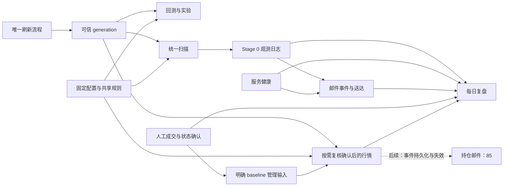

# 架构与模块建设现状

核对基线：2026-09-07，基于 main [ffc83975](https://github.com/amazing-fish/mu-5x-fibonacci-trading/commit/ffc83975b72132ad4fb2dba2631f805714670942)（含 PR #114）及本次 #85 baseline 持仓复核实现。本文说明仓库中的实现和接入；未以此验证实际服务存活、收件箱或连续运行数据，不据此宣布部署、运维或策略效果验收完成。

## 从最终工作反推模块

一个可用的交易研究系统，需要依次回答六个问题：观测是否可信、规则能否重现、结论有什么证据、实时判断能否持续留下记录、真实成交与当前状态是什么、外部动作能否在失败后核对恢复。

因此，目录存在或代码量不是完成标准。这里的“已接通”只表示有真实调用方和入口；单元测试、合并交付、运行验收与策略有效性是不同证据，不合并成一个完成百分比。

## 当前模块矩阵

| 模块 / 必须回答的问题 | 已有建设与真实接入 | 仍缺什么 / 所属工作 |
|---|---|---|
| **可信行情**：输入是否完整、同源、可重放 | `market_data.trusted_data` 分开刷新和读取；v4 月分段、hash/时序/多周期校验、固定 generation、上市月起点验证均有实现，研究和扫描已消费。 | 数据驻留、GC 不在当前实现。#107 的冷启动代码已合并，Issue 仍开放；运维验收须另查。 |
| **策略规则**：同样输入是否得到同样判断 | `strategy.py` 提供固定配置、指标过滤和入场规则；`strategies.registry` 统一名称/别名/默认集合；`position_rules` 被回测、shadow 和人工 baseline 复核复用。 | 人工复核只支持明确映射的有效买入和 baseline；卖出后状态、延迟 transition 与管理邮件仍归 #85。 |
| **回测与实验**：假设如何被检验 | `backtest.py` 承担 OHLC 成交和权益模拟；walk-forward、Fibonacci 扫描、候选 ladder 均有入口。普通回测/HTML/ladder 支持固定历史 generation。 | 全 registry 的同快照 robustness 比较未完成（#83）；部分 HTML/walk-forward 单笔收益标签待明确（#88）。 |
| **研究解释与结论**：收益靠什么、是否可比较 | `research.robustness` 提供基准、top-N 集中度、stage 分布；`candidate_conclusions` 保存严格候选结论；ladder 披露实际配置杠杆和账户收益。 | 短样本、不同风险预算及样本外/前瞻证据仍归 #99；reader 异常边界 #96，候选名单解耦 #101。`mu_current` 返回 baseline 名称，不是持续策略选择系统。 |
| **候选标的选择**：固定策略应用到谁 | `selection.basket.rank_candidates` 提供离线候选行排序；实时 universe 由可信 manifest 和 watchlist 提供。 | 只有基础排序，尚无完整候选池状态、跨标的证据与自动选优闭环；不能把 Top universe 当策略选股结果。扩展依 #73/#99 的实际研究需求。 |
| **扫描、运行与健康**：实时判断能否稳定产生证据 | `ScanCycle` 统一 dry-run 判断；`stage0` 只持久化已完成结果；`signal_service` 调度刷新和扫描，`service_health` 区分数据、扫描、写盘、进程状态。 | #62/#97 的代码交付已完成；长期稳定性不由一次运行或进程存活证明，归 #99。服务扫描仍经 `demo_trading.run_once(dry_run=True)` 适配。 |
| **邮件通知**：是否按有效信号提醒、结果是否可查 | `notifications` 已接入场/失效和健康/恢复事件，SQLite outbox 保存身份、游标、重试和 unknown 送达；显式 `--send` 才使用 SMTP。 | #98 的代码已合并，持仓邮件仍依赖 #85；真实受控 SMTP、常驻与持续运行证据分别验收。配置 fingerprint 不能代替代码版本。 |
| **人工反馈与持仓事实**：用户实际做了什么 | `manual_positions` 保存成交及更正、当前阶段/止损和独立管理输入；`position_management` 将明确的买入阶段投影为共享规则输入，固定当前可信 generation，按需检查确认后的完整区间。视图区分未知、失效、行情阻断与候选。 | 人工记录未经交易所核对，不能声称账户全量。建议不写回事实；账本级 `management_status` 不代表评估结果。卖出后映射、延迟 transition、持仓事件/邮件及 OKX 真实来源仍待完成（#85/#90）。 |
| **执行规划与持久构件**：动作能否绑定证据与授权 | `execution` 已有类型化决策、`OrderIntentFactory`、instrument rounding、`SQLiteExecutionStore` 和审计/预留契约。 | factory/store 尚未接入现有 Demo 编排，仓库 `config/` 未包含已批准 release。真实 release 和 scan→intent→授权→reserve→adapter 归 #100。 |
| **OKX 适配与受控 Demo**：允许哪些外部动作 | `live.okx` 支持只读账户、shadow 和显式确认的 Demo；现有 Demo 应用有买入、敞口限制、确定性 `clOrdId` 及部分失效 bot 限价单撤销。 | 不具备完整成交去重、仓位/余额对账、unknown 恢复、退出保护及风险停机闭环（#100）。Production 未实现（#7）。 |
| **可视化与使用入口**：人能否理解和复核 | `viz` 已渲染回测、数据健康、入场/shadow 看板和每日复盘；`commands` 与兼容 CLI 提供操作入口。复盘支持实时更新、反馈及人工台账。 | 展示不是权威策略或账户状态；#88 仍有收益标签工作，#99 仍需冻结实验与前瞻评估。没有统一自动交易控制台。 |

## 已接通的证据流

复核只读人工事实和固定行情，建议不变成实际成交、已执行止损或邮件。最早退出触发不会因后续恢复而消失；每根检查都使用确认的实际止损。现有 Demo 编排可以经显式确认触达 Demo broker，上图人工记录尚未接入它；新的 intent/store 也尚未替代旧编排，归 #100 衔接。

## 模块职责与接口

- **事实由来源模块负责**：行情由可信发布层持有，扫描由 `ScanCycle` 产出，运行状态由 `HealthStore` 产出，送达由通知 outbox 记录，人工成交由台账记录。视图读取这些结果。
- **策略语义集中复用**：`models` 的类型化决策区分 READY/WAIT/BLOCK；`core.market_context` 统一 1h 收盘后对 15m 的可见性；`decide_pyramid_add` / `tighten_stop` 是共同规则入口。回测负责模拟成交和权益，不把该模拟当真实回执。
- **研究结论与执行资格分开**：registry 名称、配置指纹、历史 candidate 和已审批 release 各有不同身份；release 解析保持 exact-ID，不能用 latest、mock 或宽松 fallback 补上执行前置。
- **持久化只共用合适的底层能力**：`fs_durability`、`file_locks` 提供系统原语；行情 pointer、策略 artifact、观测日志、邮件 outbox 和执行存储各自保留提交/恢复协议，不能合成一个通用“成功”状态。

`tests/test_architecture_dependencies.py` 已限制 core/entry/execution/strategies 反向导入应用层，也约束 scan-cycle/观测 writer 的依赖。它不是“全仓无环”的证明：例如策略构造仍与 registry 相互引用，execution 的 release 输入仍由 research 模块提供。当前按实际契约组织模块，不为目录对称移动代码或增加接口。

## 源码与验证入口

下表是可检查入口，不表示本次重新执行了这些产品测试。本轮文档核对基于源码、真实调用方、现有回归及合并记录；运行证据另查。

| 关注点 | 实现 | 回归入口 |
|---|---|---|
| 数据与上市边界 | [refresh](../mu_strategy/market_data/trusted_data/refresh.py)、[load](../mu_strategy/market_data/trusted_data/load.py) | [分段存储](../tests/test_trusted_segmented_storage.py)、[上市时间](../tests/test_okx_listing_time.py) |
| 策略与回测 | [registry](../mu_strategy/strategies/registry.py)、[position_rules](../mu_strategy/strategies/position_rules.py)、[backtest](../mu_strategy/backtest.py) | [规则](../tests/test_position_rules.py)、[registry](../tests/test_strategy_registry.py) |
| 研究与选择 | [robustness](../mu_strategy/research/robustness.py)、[ladder](../mu_strategy/experiments/strategy_ladder.py)、[basket](../mu_strategy/selection/basket.py) | [研究选择](../tests/test_research_selection.py)、[ladder](../tests/test_strategy_ladder.py) |
| 扫描与运行 | [scan_cycle](../mu_strategy/scan_cycle.py)、[signal_service](../mu_strategy/signal_service.py) | [依赖约束](../tests/test_architecture_dependencies.py)、[服务](../tests/test_signal_service.py) |
| 通知与人工台账 | [notifications](../mu_strategy/notifications/service.py)、[manual_positions](../mu_strategy/manual_positions.py) | [通知测试入口](email-alerts.md)、[持仓状态](../tests/test_position_state.py) |
| 人工持仓规则复核 | [position_management](../mu_strategy/position_management.py)、[复核页面](../mu_strategy/viz/position_ledger.py) | [输入、行情与页面回归](../tests/test_position_management.py) |
| 执行构件与 Demo | [intents](../mu_strategy/execution/intents.py)、[store](../mu_strategy/execution/store.py)、[demo_trading](../mu_strategy/demo_trading.py) | [intent](../tests/test_order_intents.py)、[store](../tests/test_execution_store.py)、[Demo](../tests/test_okx_demo_loop.py) |
| 可视化与复盘 | [viz](../mu_strategy/viz)、[signal_review](../mu_strategy/signal_review.py) | [复盘](../tests/test_signal_review.py)、[实时页面](../tests/test_signal_review_live.py) |

近期合并证据：[历史回放 #103](https://github.com/amazing-fish/mu-5x-fibonacci-trading/pull/103)、[扫描统一 #104](https://github.com/amazing-fish/mu-5x-fibonacci-trading/pull/104)、[信号服务 #105](https://github.com/amazing-fish/mu-5x-fibonacci-trading/pull/105)、[邮件 #106](https://github.com/amazing-fish/mu-5x-fibonacci-trading/pull/106)、[上市边界 #108](https://github.com/amazing-fish/mu-5x-fibonacci-trading/pull/108)、[复盘 #109](https://github.com/amazing-fish/mu-5x-fibonacci-trading/pull/109)、[反馈 #110](https://github.com/amazing-fish/mu-5x-fibonacci-trading/pull/110)、[台账 #112](https://github.com/amazing-fish/mu-5x-fibonacci-trading/pull/112)、[状态确认 #113](https://github.com/amazing-fish/mu-5x-fibonacci-trading/pull/113)。

## 深入阅读与资料身份

| 文档 | 负责回答 |
|---|---|
| [产品路线](product-roadmap.md) | S1/S2 的验收、依赖和 Issue 归属 |
| [可信行情](data-guide.md) / [研究指南](research-guide.md) | 数据操作、回放、策略与实验使用方式 |
| [执行设计](execution-roadmap.md) | 原 Stage 0–4、Stage 3 冻结契约及验收映射；目标与历史证据有明确标记 |
| [发布溯源](strategy-release-provenance.md) / [Stage 0 记录](stage0-observations.md) | 当前具体协议，不在总览重复全文 |
| [Demo 操作](demo-guide.md) / [复盘](signal-review.md) / [邮件](email-alerts.md) | 对应使用流程与操作边界 |
| [月分段设计](plans/2026-07-28-trusted-generation-segmented-storage-design.md) / [发布设计](plans/2026-07-12-strategy-release-provenance-design.md) | 设计来源与不变量；不能据日期认定失效，也不作为实时状态清单 |
| [历史参数](fibonacci-preferred-parameters.md) / [旧实施计划](archive/legacy-plans/README.md) | 历史背景，不作为当前策略有效性的证据 |

`mu_strategy.data`、`strategy`、`walk_forward`、`visualize`、`cli` 的既有导入入口保留；扁平模块并不表示相应职责不存在。CLI/visualize 的导入路径兼容不恢复旧数据行为。

数据与系统持久化细节已集中到[可信行情指南](data-guide.md#filesystem-durability)。

原执行设计入口已移至[分阶段执行设计与契约](execution-roadmap.md#staged-execution-roadmap)，核心合同内容保留。
